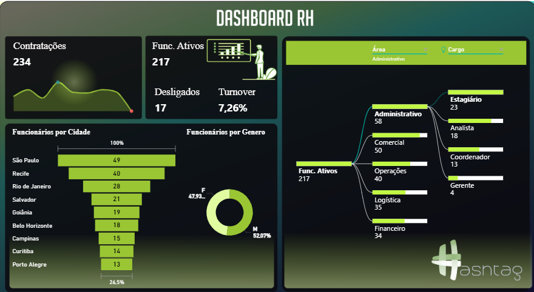

# Dashboard de RH em Power BI

Este repositório contém um **Dashboard de Recursos Humanos** desenvolvido em Power BI como parte dos meus estudos em Business Intelligence e People Analytics. O objetivo foi criar uma visão executiva do quadro de colaboradores, acompanhando contratações, desligamentos, turnover e distribuição de funcionários por cidade, gênero, área e ocupação.

Esse Dashboard foi feito junto com a equipe da **Hashtag Treinamentos**

## 🎯 Objetivo do Projeto

- Simular o dia a dia de um profissional de **People Analytics** dentro das empresas.
- Consolidar indicadores de RH em um painel único e interativo.
- Explorar visuais e recursos avançados do Power BI (como **árvore hierárquica** e **tooltip**).
- Praticar boas práticas de visualização e storytelling com dados.

## 📊 Principais Indicadores

Alguns dos KPIs trabalhados no dashboard:

- **Contratações**: 234  
- **Funcionários Ativos**: 217  
- **Demitidos**: 17  
- **Rotatividade**: 7,26%  
- **Salário Total**: R$ 1,57 milhão  

Além disso, o painel apresenta:

- Distribuição de **Funcionários por Cidade**
- Distribuição de **Funcionários por Gênero**
- Árvore Hierárquica de **Funcionários Ativos por Cargos**
- **Tooltip** integrado ao gráfico Funcionários por Cidade apontando as horas extras por cargo

## 📸 Visão do Dashboard

